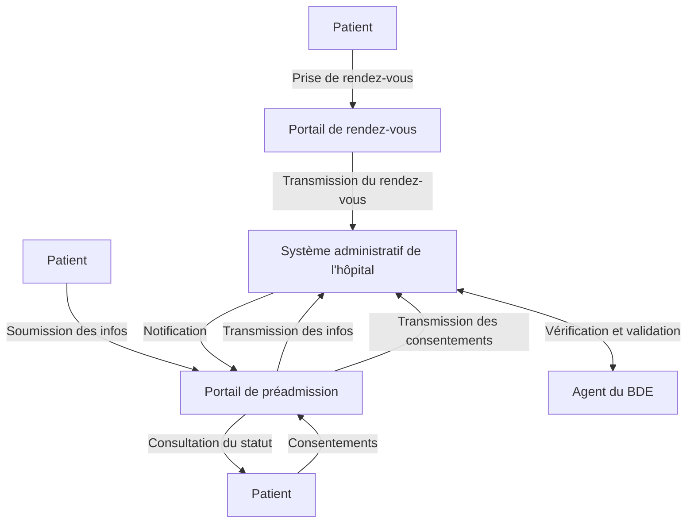

### Objectif

Cette page décrit les échanges entre les différentes parties impliquées dans une **pré-admission hospitalière en ligne**, en tenant compte des **contraintes réseau** (pas d'accès direct au SIH depuis Internet) et des **retours manuels** de l’agent administratif. Les flux décrits ici s’appuient sur les ressources FHIR définies dans cet IG.

---

### Acteurs

| Acteur | Description |
|--------|-------------|
| 👤 **Patient** | Fournit ses informations de préadmission via un portail en ligne. |
| 🗓 **Portail de rendez-vous** | Plateforme externe pour réserver les consultations. |
| 🌐 **Portail de préadmission** | Plateforme en ligne, gérée par un tiers pour recueillir les données administratives et médicales. |
| 🏥 **Système administratif de l'hôpital** | Système central de l’hôpital pour gérer les données administratives. |
| 👨‍💼 **Agent du Bureau des Entrées (BDE)** | Vérifie et valide manuellement les informations reçues. |

---

### Scénario global des flux

#### 1. **Prise de rendez-vous**

- **Acteurs impliqués** : Patient, Portail de rendez-vous, Système administratif de l'hôpital.
- **Description** : Le patient réserve une consultation ou un séjour via un portail externe. Une ressource `Appointment` est créée dans le Portail de rendez-vous et est transmis au Système administratif de l'hôpital pour planifier la venue.
- **Ressources utilisées** :
  - `Appointment` : Contient les informations sur le rendez-vous (date, heure, participants, raison).
  - `Consent` : Contient les consentements du patient.
  - `QuestionnaireResponse`: Contient les réponses du patient au questionnaire soumis lors de sa prise de rendez-vous.
  - `Patient` : Référence le patient concerné.

**Schéma :**

```plaintext
Patient → [Portail de rendez-vous] → Système administratif de l'hôpital
```

---

#### 2. **Soumission des informations de préadmission**

- **Acteurs impliqués** : Patient, Portail de préadmission, Système administratif de l'hôpital.
- **Description** : Le patient remplit un formulaire de préadmission sur le portail de préadmission. Les informations administratives (identité, couverture sociale, etc.) et les documents justificatifs (carte d’identité, carte Vitale, etc.) sont collectés.
- **Ressources utilisées** :
  - `Patient` : Contient les informations administratives du patient.
  - `Coverage` : Référence les informations sur la couverture sociale (AMO/AMC).
  - `DocumentReference` : Contient les pièces justificatives téléversées par le patient.

**Schéma :**

```plaintext
Patient → [Portail de préadmission] → Système administratif de l'hôpital
```

---

#### 3. **Recueil des consentements**

- **Acteurs impliqués** : Patient, Portail de préadmission, Système administratif de l'hôpital.
- **Description** : Le patient donne son consentement pour le traitement de ses données personnelles (RGPD), l’accès au DMP, ou la transmission de données à des tiers. Ces consentements sont transmis au Système administratif de l'hôpital.
- **Ressources utilisées** :
  - Consent : Contient les informations sur les consentements recueillis (type, statut, règles applicables).

**Schéma :**

```plaintext
Patient → [Portail de rendez-vous] → Système administratif de l'hôpital
```

OU

```plaintext
Patient → [Portail de préadmission] → Système administratif de l'hôpital
```

---

#### 4. **Vérification et validation par l’agent du BDE**

- **Acteurs impliqués** : Agent du BDE, Système administratif de l'hôpital.
- **Description** : L’agent du Bureau des Entrées (BDE) vérifie les informations transmises (documents, consentements, couverture sociale) et valide ou refuse la préadmission.
- **Ressources utilisées** :
  - `Encounter` : Contient les informations sur la préadmission (statut, patient, rendez-vous associé).

**Schéma :**

```plaintext
Système administratif de l'hôpital ↔ Agent du BDE
```

---

#### 5. Notification au patient

- **Acteurs impliqués** : Système administratif de l'hôpital, Portail de préadmission, Patient.
- **Description** : Une fois la préadmission validée ou refusée, le patient est notifié via le portail de préadmission. En cas de refus, le motif est communiqué.
- **Ressources utilisées** :
  - `Encounter` : Mise à jour du statut de la préadmission (ACCEPTED ou REFUSED). Un commentaire de l'agent du BDE peut être transmis.

**Schéma :**

```plaintext
SIH → [Portail de préadmission] → Patient
```

### Schéma global des flux

```plaintext
1. Prise de rendez-vous
   Patient → [Portail de rendez-vous] → Système administratif de l'hôpital

2. Soumission des informations de préadmission
   Patient → [Portail de préadmission] → Système administratif de l'hôpital

3. Recueil des consentements
   Patient → [Portail de préadmission] → Système administratif de l'hôpital

4. Vérification et validation par l’agent du BDE
   Système administratif de l'hôpital ↔ Agent du BDE

5. Notification au patient
   Système administratif de l'hôpital → [Portail de préadmission] → Patient
```



### Conclusion

Les flux décrits dans ce document permettent de structurer et de coordonner les échanges entre les différents acteurs impliqués dans la préadmission hospitalière. En s’appuyant sur les ressources FHIR (`Appointment`, `Patient`, `Coverage`, `DocumentReference`, `Consent`, `Encounter`, etc.), ce processus garantit une gestion efficace et conforme aux exigences réglementaires.
