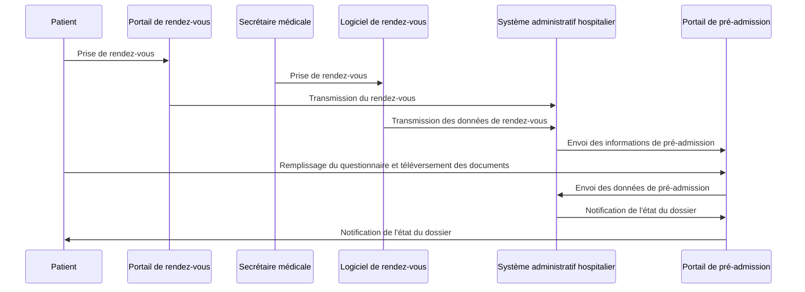

# Guide d’Implémentation FHIR – Pré-admission Hospitalière en Ligne

Bienvenue dans le guide d'implémentation FHIR pour la pré-admission hospitalière en ligne. Ce guide est structuré en plusieurs sections pour faciliter la compréhension.

# 📘 Contexte et Objectif

## Contexte
La pré-admission hospitalière est une étape administrative essentielle permettant à l’établissement de santé de préparer l’accueil du patient en amont. Elle consiste à recueillir, à distance, les informations nécessaires à l’identification du patient, à la gestion de sa couverture sociale et à la collecte des documents justificatifs avant son arrivée à l’hôpital.

Ce guide propose une architecture basée sur le standard **FHIR** pour assurer des échanges fluides, sécurisés et interopérables entre les différents systèmes impliqués.

## Objectif
Définir les spécifications d’échange de données entre :
- un portail web patient
- un logiciel de gestion des rendez-vous
- un système administratif hospitalier

Il repose sur des profils FHIR adaptés au contexte français (INS, couverture sociale, pièces justificatives).

# 🎯 Périmètre et Acteurs

## Périmètre
- `Appointment` : planification d’un rendez-vous
- `Encounter` : pré-admission administrative
- `Coverage` : déclaration de couverture sociale
- `DocumentReference` : transmission de documents justificatifs

### Hors périmètre :
- Aspects médicaux
- Urgences
- Intégration clinique

## Acteurs
- Patient
- Portail de pré-admission
- Logiciel de rendez-vous
- Système administratif hospitalier

# 🧩 Ressources FHIR & Profils

## Ressources utilisées
- `Appointment`, `Encounter`, `Coverage`, `DocumentReference`, `Patient`, `Consent`, `QuestionnaireResponse`

## Profils personnalisés
- `PreadmissionAppointmentFr`
- `PreadmissionEncounterFr`
- `PreadmissionCoverageFr`
- `PreadmissionDocumentReferenceFr`

## Extensions spécifiques
- Type de pièce d’identité
- Identifiant INS
- Rattachement complémentaire

## Conformité nationale
- INS comme identifiant principal
- Hébergement HDS
- Alignement ANS

# 🔄 Enchaînement des Processus

## Parcours global
### 1. Portail patient
- Questionnaire libre
- Téléversement de documents
- Consentement DMP

### 2. Logiciel de rendez-vous
- Création de `Appointment`
- Association : `QuestionnaireResponse`, `Consent`, `DocumentReference`

### 3. Système administratif
- Récupération des données
- Création `Encounter` (VN temporaire)
- Vérification `Coverage`

## Identifiant de préadmission (VN)
```json
"identifier": [
  {
    "use": "temp",
    "type": {
      "coding": [
        {
          "system": "http://interopsante.org/fhir/CodeSystem/fr-core-identifier-type",
          "code": "VN",
          "display": "Visit Number"
        }
      ]
    },
    "system": "urn:oid:1.2.250.1.71.4.2.2.1330780321.z",
    "value": "2455"
  }
]
```

## Questionnaire de contexte
- Implant ? Allergies ? Aide médicale ? Contre-indications ?

## Consentement DMP (ZFA)
Description | Type |
-------------|------|
Opposition bris de glace | Oui / Non |
Opposition centre régulation | Oui / Non |
Date de recueil | Date |

# 🔄 Flux de la préadmission

Ce diagramme présente le cheminement d’un patient dans le processus de préadmission, depuis la prise de rendez-vous jusqu’à l’admission à l’hôpital.

```mermaid
flowchart TD
    A[Patient] --> B[Portail patient en ligne]
    B --> C[Prise de rendez-vous (Appointment)]
    C --> D[Remplissage du questionnaire de contexte]
    D --> E[Recueil du consentement DMP]
    C --> F[Validation par le logiciel administratif]
    F --> G[Preadmission (Encounter)]
    G --> H[Préparation du séjour hospitalier]


---

### 📄 `schema-fhir.md`

```markdown
# 🧬 Schéma FHIR du modèle de préadmission

Voici les principales ressources FHIR impliquées dans le processus de préadmission et leurs liens :

```mermaid
flowchart TD
    A[Patient] -->|Prise de rendez-vous| B[Portail de rendez-vous (ex: Doctolib)]
    A -->|Prise de rendez-vous| C[Secrétaire médicale]
    B --> D[Logiciel de rendez-vous]
    C --> D[Logiciel de rendez-vous]
    D --> E[Système administratif hospitalier]
    E --> F[Portail de pré-admission]
    F --> G[Patient]
    E -->|Notification de l'état du dossier| F 


# 🖼️ Diagrammes Complémentaires

## Diagramme de flux – Enchaînement complet
```mermaid
flowchart TD
  A[Patient] --> B[Portail Patient]
  B --> B1[Remplissage du questionnaire]
  B --> B2[Téléversement des documents]
  B --> B3[Consentement au DMP]
  B --> C[Logiciel de rendez-vous]
  C --> C1[Création de l'Appointment]
  C --> C2[Lien avec QuestionnaireResponse / Consent]
  C --> D[Système administratif]
  D --> D1[Récupération des données]
  D --> D2[Création de Encounter]
  D --> D3[Vérification de la couverture]
  D --> D4[Préparation de l’admission]
```

## Diagramme de séquence – Scénario complet



---
Ce guide est maintenu par **Interop’Santé**, sous la spécification `PreadmissionFr`. Toute contribution ou retour est bienvenu afin d’enrichir ce référentiel.
